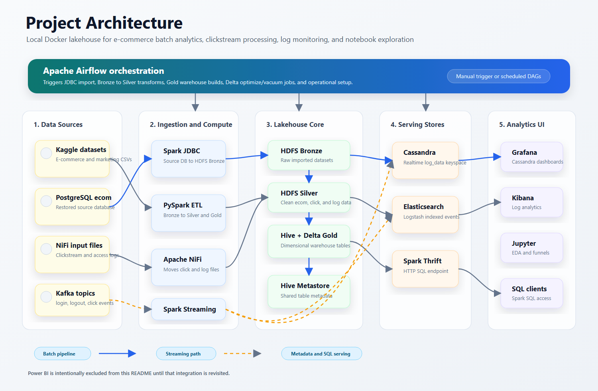
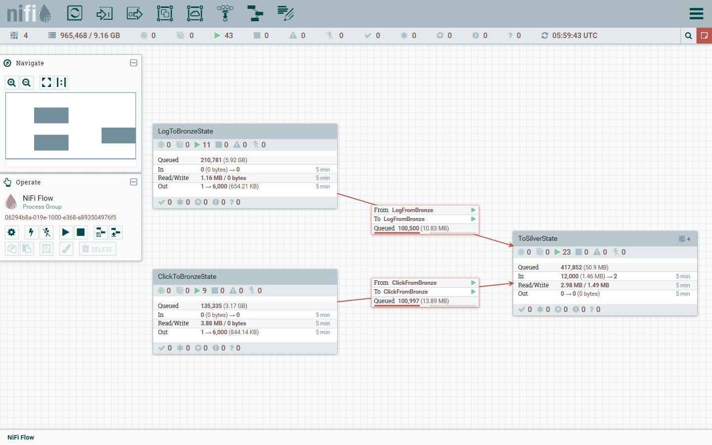
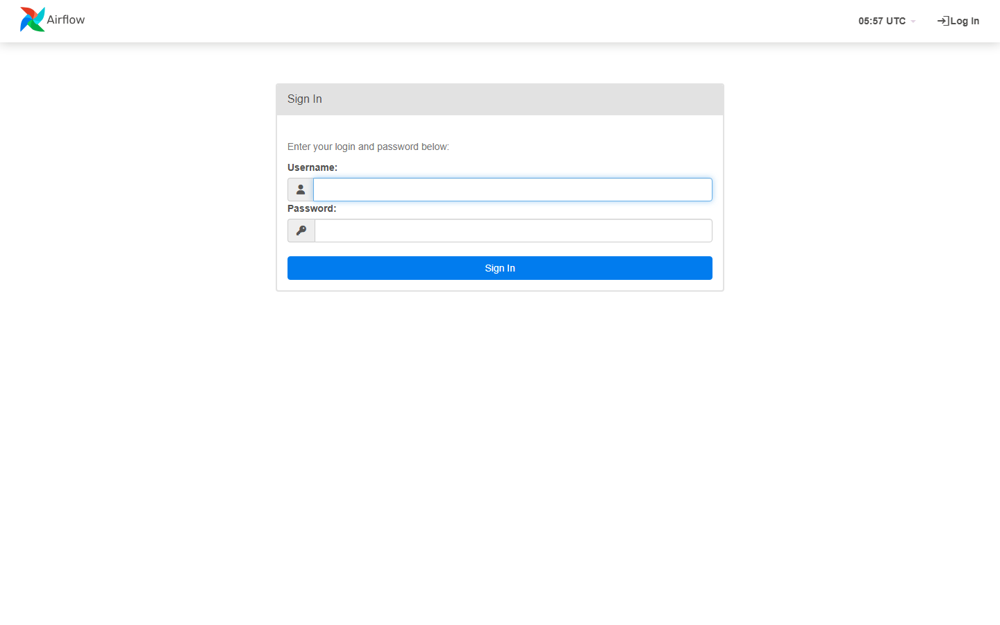
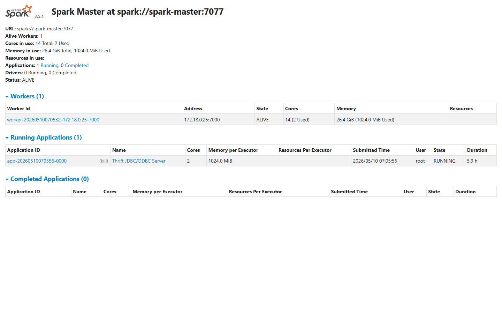
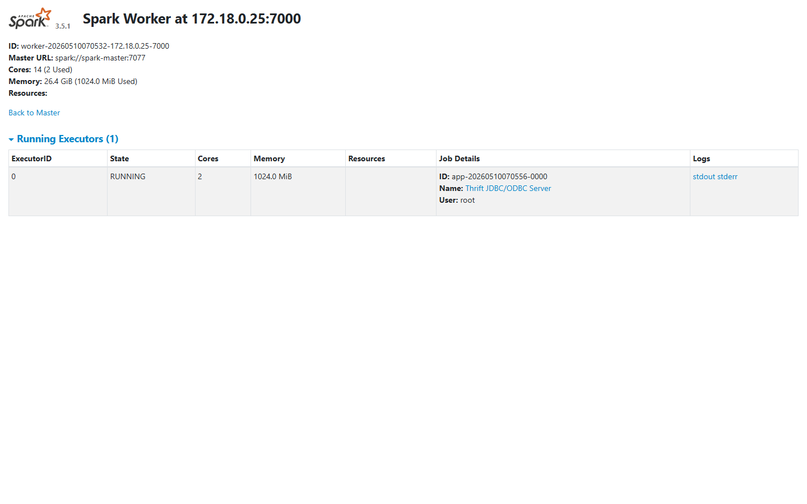
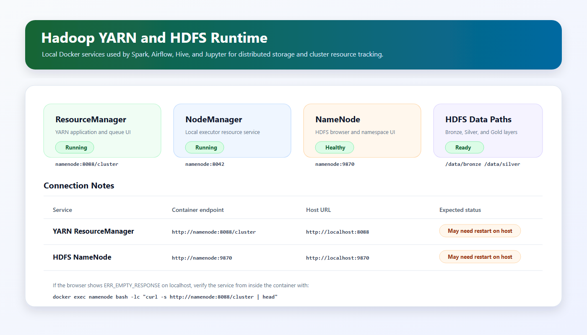
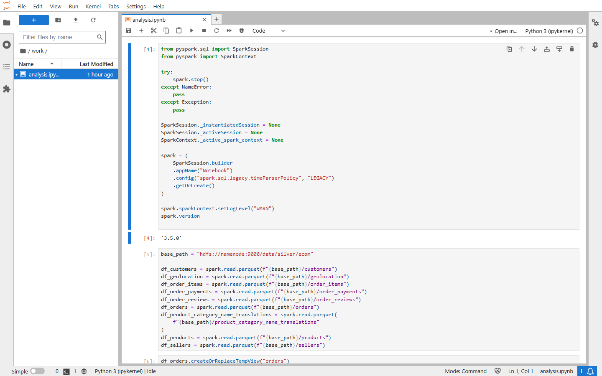
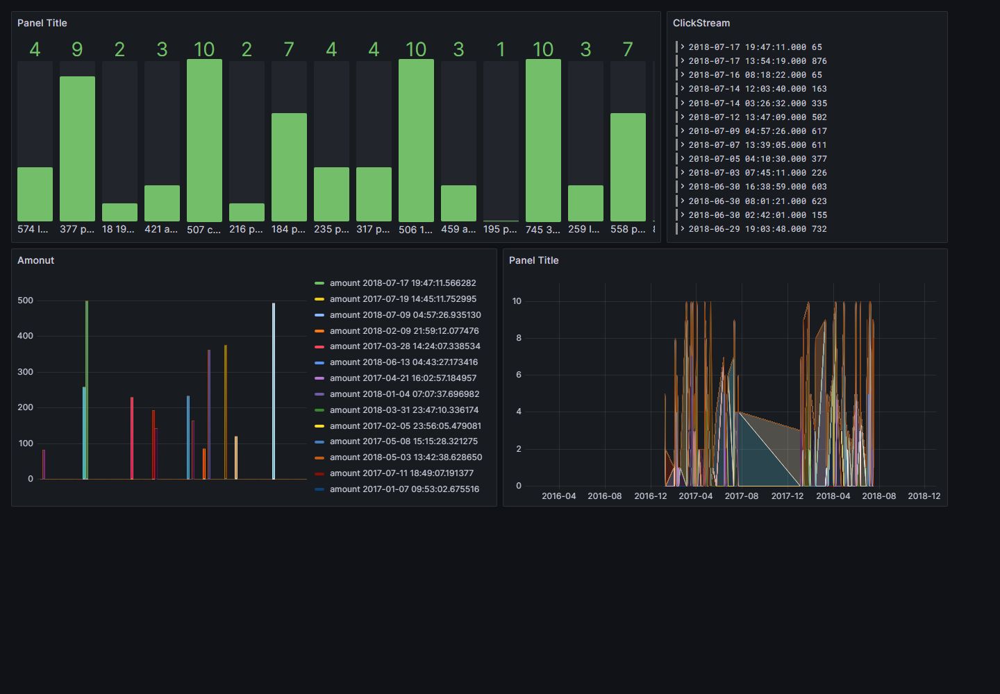
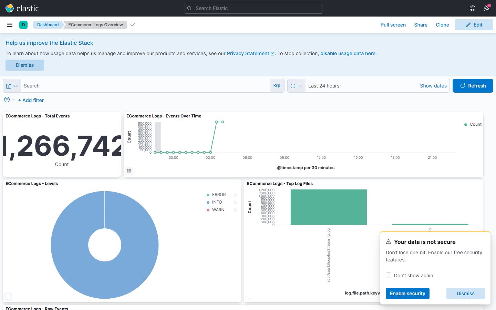
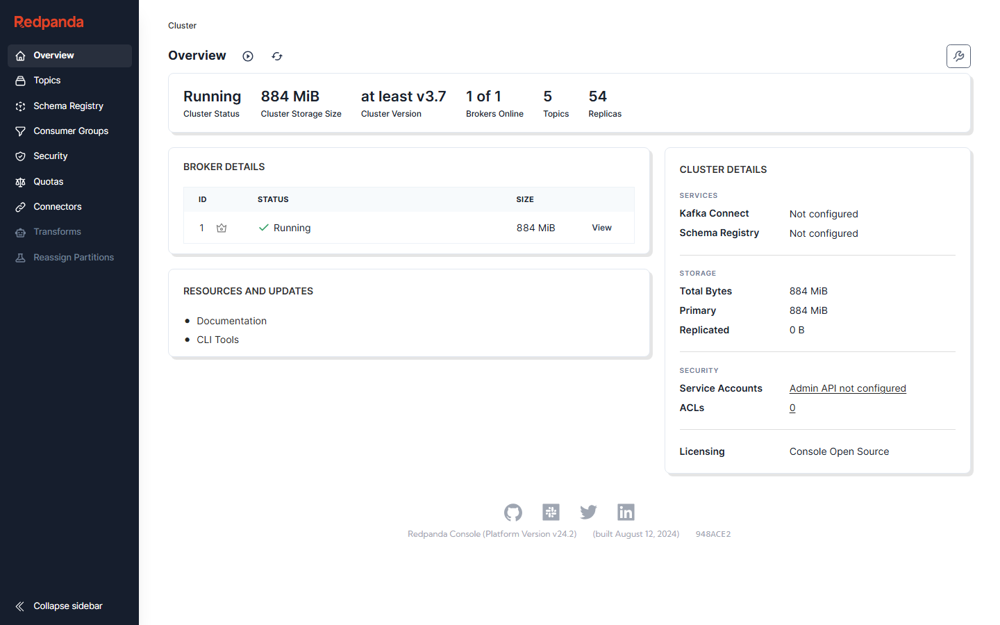

# ECommerce Insights Lakehouse - Detailed README

End-to-end lakehouse project for e-commerce analytics, clickstream processing, log monitoring, and BI-style exploration using Docker Compose, Airflow, Spark, Hadoop HDFS, Hive Metastore, Delta Lake, Cassandra, Elasticsearch, Grafana, Kibana, NiFi, Kafka, Redpanda Console, and Jupyter Notebook.

> Power BI is intentionally omitted from this README because that integration will be reviewed later.

## Table of Contents

- [Project Highlights](#project-highlights)
- [What Is New Compared With The Original README](#what-is-new-compared-with-the-original-readme)
- [Project Architecture](#project-architecture)
- [Tech Stack](#tech-stack)
- [Repository Structure](#repository-structure)
- [Data Flow](#data-flow)
- [Screenshots](#screenshots)
- [Prerequisites](#prerequisites)
- [Setup](#setup)
- [Service URLs](#service-urls)
- [Airflow DAGs](#airflow-dags)
- [Jupyter Analytics](#jupyter-analytics)
- [Grafana Dashboards](#grafana-dashboards)
- [Kibana Dashboard](#kibana-dashboard)
- [Operational Commands](#operational-commands)
- [Troubleshooting](#troubleshooting)

## Project Highlights

- Full Docker Compose lakehouse environment running locally.
- Batch ingestion from PostgreSQL into HDFS Bronze using Spark JDBC.
- E-commerce and marketing datasets processed from Bronze to Silver with PySpark.
- Gold-layer dimensional warehouse tables built with Spark, Hive, and Delta Lake.
- Streaming-style clickstream and log processing through Kafka, Spark, NiFi, Cassandra, and Elasticsearch.
- Airflow DAG orchestration with daily ingestion/ETL DAGs and weekly Delta optimization/vacuum DAGs.
- Grafana dashboards for Cassandra-backed clickstream and log analytics.
- Kibana dashboard for Elasticsearch-backed Spark/Filebeat logs.
- Jupyter notebook analytics, including a new Customer Journey Funnel from clickstream events.
- Spark Thrift Server exposed for external SQL clients through HTTP transport.

## What Is New Compared With The Original README

The current `README.md` only contains the project title. This detailed README adds:

- Complete architecture and data-flow documentation.
- Service URLs, credentials, and operational commands.
- Airflow DAG descriptions and recommended manual trigger order.
- Screenshots for the main tools in the platform.
- Jupyter analytics documentation with the new Customer Journey Funnel section.
- Grafana and Kibana setup details.
- Troubleshooting notes based on real issues encountered while running the project.

Compared with the original project state, this workspace now also includes several practical improvements:

- Spark Thrift Server configured through `http://localhost:10004/cliservice`.
- Delta Lake jars mounted into Spark containers for stable Delta/Hive usage.
- `after-compose.sh` now handles service readiness, Cassandra schema setup, Kafka topic creation, Airflow connection setup, and Spark Thrift Server startup.
- Grafana Cassandra datasource and dashboards have been configured.
- Kibana Data View and dashboard have been created for `logstash-*`.
- `notebook/analysis.ipynb` now reads Silver e-commerce tables as Parquet instead of CSV.
- `notebook/analysis.ipynb` includes Customer Journey Funnel and Product Friction analysis from clickstream data.

## Project Architecture



The architecture follows five main layers:

- Data sources: Kaggle datasets, restored PostgreSQL e-commerce data, NiFi input files, and Kafka topics.
- Ingestion and compute: Spark JDBC, PySpark ETL, Apache NiFi, and Spark Streaming.
- Lakehouse core: HDFS Bronze/Silver layers, Hive Metastore, and Delta Gold warehouse tables.
- Serving stores: Cassandra for realtime dashboard data, Elasticsearch for indexed logs, and Spark Thrift Server for SQL access.
- Analytics UI: Grafana, Kibana, Jupyter Notebook, and SQL clients.

## Tech Stack

| Area | Tools |
| --- | --- |
| Container orchestration | Docker Compose |
| Workflow orchestration | Apache Airflow, CeleryExecutor, Redis, PostgreSQL |
| Distributed storage | Hadoop HDFS |
| Processing | Apache Spark, PySpark, Spark SQL |
| Table format | Delta Lake |
| Metadata / SQL | Hive Metastore, HiveServer2, Spark Thrift Server |
| Streaming / messaging | Kafka, Redpanda Console |
| Flow management | Apache NiFi |
| Operational logs | Filebeat, Logstash, Elasticsearch, Kibana |
| Realtime store | Cassandra |
| Monitoring dashboards | Grafana |
| Analysis | Jupyter Notebook, matplotlib, seaborn, squarify, folium |

## Repository Structure

```text
.
├── airflow/              # Airflow DAGs, logs, config, plugins
├── cassandra/            # Cassandra schema setup
├── docker/               # Local Docker image build context
├── filebeat/             # Filebeat config
├── grafanaTemplate/      # Grafana dashboard JSON templates
├── hdfs/                 # Hadoop setup scripts
├── hiveconf/             # Hive/Spark Hive config
├── kibana/               # Kibana-related config/assets
├── logstash/             # Logstash pipeline config
├── nifi/                 # NiFi repositories and input data
├── notebook/             # Jupyter notebooks
├── packages/             # JDBC and Delta jars
├── postgresDB/backup/    # PostgreSQL e-commerce backup
├── spark/apps/           # PySpark jobs for JDBC, Silver, Gold, streaming, optimization, vacuum
├── spark/data/           # Spark checkpoints/data
├── docker-compose.yml
├── init.sh
├── after-compose.sh
└── README_DETAILED.md
```

## Data Flow

### 1. Initialization

`init.sh` prepares the local environment:

- Validates Docker Compose, Python, unzip, and Kaggle credentials.
- Creates `.env`.
- Downloads datasets from Kaggle.
- Places clickstream/log files under `nifi/data`.
- Places the PostgreSQL backup under `postgresDB/backup`.
- Initializes Airflow metadata.

### 2. Platform Startup

`docker compose up -d` starts the full stack:

- Airflow webserver, scheduler, worker, triggerer, Flower.
- PostgreSQL for Airflow and PostgreSQL for e-commerce source data.
- Hadoop NameNode/YARN.
- Spark master/worker.
- Hive Metastore and HiveServer2.
- Kafka and Redpanda Console.
- NiFi.
- Cassandra.
- Elasticsearch, Logstash, Filebeat, Kibana.
- Grafana.
- Jupyter PySpark notebook.

### 3. Post-Compose Setup

`after-compose.sh` performs service-level setup:

- Waits for key containers.
- Initializes Hadoop folders.
- Restores the PostgreSQL e-commerce database.
- Creates Cassandra keyspace/tables.
- Starts Spark Thrift Server if it is not already running.
- Creates Kafka topics: `login`, `logout`, `clickin`, `clickout`.
- Adds Airflow SSH connections for Spark and HDFS.

### 4. Airflow Batch Pipelines

Airflow orchestrates:

- Source PostgreSQL to HDFS Bronze.
- Bronze to Silver for e-commerce and marketing.
- Silver to Gold using Spark, Hive, and Delta.
- Weekly optimization and vacuum jobs.

### 5. Realtime / Observability Pipelines

- NiFi moves raw log and click files through flow groups.
- Spark streaming apps process click/log events.
- Cassandra stores clickstream/log analytical tables.
- Filebeat ships Spark logs to Logstash.
- Logstash indexes logs into Elasticsearch.
- Grafana and Kibana visualize runtime behavior.

## Screenshots

### NiFi Flow

NiFi manages file movement for log and clickstream flows.



### Airflow

Airflow is the main orchestrator for ingestion, Silver, Gold, optimization, and vacuum DAGs.



### Spark Master

Spark master tracks cluster state and running Spark applications.



### Spark Worker

Spark worker executes Spark jobs submitted by Airflow, notebooks, and streaming scripts.



### Hadoop YARN and HDFS

YARN tracks cluster-level application/resource activity, while HDFS stores the Bronze, Silver, and Gold lakehouse layers. The image below is a documentation-safe runtime view because Docker Desktop can intermittently return `ERR_EMPTY_RESPONSE` for host-mapped Hadoop ports even when the services are healthy inside the container.



### Jupyter Notebook

`analysis.ipynb` contains e-commerce analytics and the new clickstream Customer Journey Funnel.



### Grafana

Grafana is used for Cassandra-backed clickstream/log dashboards. The screenshot below shows the imported ClickStreamEcom dashboard after authentication.



### Kibana

Kibana visualizes Elasticsearch log data indexed through Filebeat and Logstash.



### Redpanda Console

Redpanda Console provides a UI for Kafka topics and message inspection.



## Prerequisites

Recommended environment:

- Windows + WSL2 Ubuntu.
- Docker Desktop with WSL integration enabled.
- Docker Compose v2.
- Python 3 with `venv` support.
- Kaggle API token at one of:
  - `./.kaggle/kaggle.json`
  - `~/.kaggle/kaggle.json`

The project assumes it is run from the repository root.

## Setup

### 1. Initialize project files and datasets

```bash
./init.sh
```

This creates `.env`, downloads Kaggle datasets, prepares local folders, and initializes Airflow metadata.

### 2. Start all services

```bash
docker compose up -d
```

### 3. Run post-start setup

```bash
./after-compose.sh
```

### 4. Check container state

```bash
docker ps
```

### 5. Optional: follow logs

```bash
docker logs -f airflow-webserver
docker logs -f spark-master
docker logs -f nifi
docker logs -f grafana
docker logs -f kibana
```

## Service URLs

| Tool | URL | Notes |
| --- | --- | --- |
| Airflow | http://localhost:6060 | User: `thanhdn`, password: `thanhdn` |
| Flower | http://localhost:5555 | Airflow Celery worker monitor |
| Spark Master | http://localhost:8080 | Spark cluster UI |
| Spark Worker | http://localhost:8081 | Spark worker UI |
| Spark Thrift Server | `http://localhost:10004/cliservice` | HTTP transport path for Spark SQL clients |
| Hadoop NameNode | http://localhost:9870 | HDFS UI. If the browser returns `ERR_EMPTY_RESPONSE`, verify from inside the container with `docker exec namenode bash -lc "curl -I http://localhost:9870"` |
| Hadoop YARN | http://localhost:8088 | Resource manager UI. If the browser returns `ERR_EMPTY_RESPONSE`, verify from inside the container with `docker exec namenode bash -lc "curl -s http://namenode:8088/cluster | head"` |
| NiFi | http://localhost:8443/nifi/ | The compose file exposes NiFi over HTTP on port 8443 |
| JupyterLab | http://localhost:9999 | Get token with `./get-token.sh` |
| Grafana | http://localhost:3000 | Default: `admin/admin` |
| Kibana | http://localhost:5601 | No local auth configured |
| Redpanda Console | http://localhost:1010 | Kafka topic UI |
| Elasticsearch | http://localhost:9200 | REST API |
| Cassandra | `localhost:9042` | CQL port for `cassandra1` |
| PostgreSQL ecom | `localhost:5431` | User/pass/db: `postgres/postgres/ecom` |
| HiveServer2 | `localhost:10000` | Hive JDBC/Thrift |

## Airflow DAGs

Current DAGs:

| DAG | Purpose | Schedule |
| --- | --- | --- |
| `Import_Ecom_data_to_Bronze_State_using_Spark_JDBC` | Import e-commerce PostgreSQL tables to HDFS Bronze | Daily |
| `Ecom_from_Bronze_to_Silver_using_Spark` | Clean/process e-commerce Bronze to Silver | Daily |
| `Import_Marketing_data_to_Bronze_State_using_Spark_JDBC` | Import marketing data to HDFS Bronze | Daily |
| `Marketing_from_Bronze_to_Silver_using_Spark` | Clean/process marketing Bronze to Silver | Daily |
| `Ecom_from_Silver_to_Gold_DataWarehouse_with_Hive` | Build e-commerce Gold warehouse tables | Daily |
| `Log_from_Silver_to_Gold_with_Hive` | Build log/clickstream Gold tables | Daily |
| `Ecom_Optimization_DataWarehouse` | Optimize Delta warehouse tables | Weekly |
| `Ecom_Vacuum_DataWarehouse` | Vacuum Delta warehouse tables | Weekly |
| `Log_Optimization_Clickstream_Log` | Optimize clickstream/log Delta tables | Weekly |
| `Log_Vacuum_Clickstream_Log` | Vacuum clickstream/log Delta tables | Weekly |

Useful commands:

```bash
docker exec airflow-webserver airflow dags list
docker exec airflow-webserver airflow dags list-runs -d <dag_id>
docker exec airflow-webserver airflow tasks list <dag_id>
```

Manual trigger order for an end-to-end batch run:

```bash
docker exec airflow-webserver airflow dags trigger Import_Ecom_data_to_Bronze_State_using_Spark_JDBC
docker exec airflow-webserver airflow dags trigger Ecom_from_Bronze_to_Silver_using_Spark
docker exec airflow-webserver airflow dags trigger Import_Marketing_data_to_Bronze_State_using_Spark_JDBC
docker exec airflow-webserver airflow dags trigger Marketing_from_Bronze_to_Silver_using_Spark
docker exec airflow-webserver airflow dags trigger Ecom_from_Silver_to_Gold_DataWarehouse_with_Hive
docker exec airflow-webserver airflow dags trigger Log_from_Silver_to_Gold_with_Hive
```

Optimization/vacuum DAGs should usually run after Gold data is built:

```bash
docker exec airflow-webserver airflow dags trigger Ecom_Optimization_DataWarehouse
docker exec airflow-webserver airflow dags trigger Log_Optimization_Clickstream_Log
docker exec airflow-webserver airflow dags trigger Ecom_Vacuum_DataWarehouse
docker exec airflow-webserver airflow dags trigger Log_Vacuum_Clickstream_Log
```

## Jupyter Analytics

Notebook:

```text
notebook/analysis.ipynb
```

Open Jupyter:

```bash
./get-token.sh
```

Then open:

```text
http://localhost:9999/lab/tree/work/analysis.ipynb?token=<token>
```

Main analyses:

- Orders by date.
- Orders by day of week and hour.
- Top cities by order volume.
- Product and shipping cost distribution.
- Sales by product category.
- Sales trend by selected category.
- Customer lifetime value map.
- Customer Journey Funnel from clickstream.
- Product Friction analysis from clickstream.

The clickstream section reads:

```python
clickstream_path = "hdfs://namenode:9000/data/silver/click"
```

It defaults to:

```python
clickstream_max_events = 200_000
```

Set it to `None` to analyze the full clickstream dataset:

```python
clickstream_max_events = None
```

## Grafana Dashboards

Dashboard templates are stored in:

```text
grafanaTemplate/
```

Imported dashboards:

- `ClickStreamEcom`
- `LogEcom`

Datasource:

- Type: Cassandra
- Name/UID: `hadesarchitect-cassandra-datasource`
- URL: `cassandra1:9042`
- Keyspace: `log_data`

Cassandra tables:

```text
log_data.clicks
log_data.logs
```

Direct URLs:

```text
http://localhost:3000/d/bda5d67a-2be0-4498-9c21-965fc09053c8/clickstreamecom
http://localhost:3000/d/a45fe361-4e40-4ae0-a87c-ca76efa78274/logecom
```

## Kibana Dashboard

Elasticsearch index pattern:

```text
logstash-*
```

Time field:

```text
@timestamp
```

Current dashboard:

```text
ECommerce Logs Overview
```

Open:

```text
http://localhost:5601/app/dashboards#/view/ecommerce-logs-overview
```

Panels:

- `ECommerce Logs - Total Events`
- `ECommerce Logs - Events Over Time`
- `ECommerce Logs - Levels`
- `ECommerce Logs - Top Log Files`
- `ECommerce Logs - Raw Events`

Check Elasticsearch:

```bash
curl http://localhost:9200/_cat/indices?v
```

Example observed index:

```text
logstash-2026.05.08-000001
```

## Operational Commands

### HDFS

```bash
docker exec namenode hdfs dfs -ls /data
docker exec namenode hdfs dfs -ls -R /data/silver
docker exec namenode hdfs dfs -du -h /data
```

### Spark streaming

```bash
docker exec -it spark-master bash /opt/spark-apps/streaming/clickStreaming.sh
docker exec -it spark-master bash /opt/spark-apps/streaming/logStreaming.sh
```

### Kafka topics

```bash
docker exec kafka /opt/kafka/bin/kafka-topics.sh --bootstrap-server kafka:9092 --list
```

### Cassandra

```bash
docker exec cassandra1 cqlsh -e "DESCRIBE KEYSPACES;"
docker exec cassandra1 cqlsh -k log_data -e "DESCRIBE TABLES;"
```

### Spark Thrift Server

The Spark Thrift Server is started by `after-compose.sh` and exposed as:

```text
http://localhost:10004/cliservice
```

Inside Docker, it listens on Spark master port `10001`.

### Restart selected services

```bash
docker restart grafana
docker restart kibana elasticsearch
docker restart jupyter-pyspark
```

## Troubleshooting

### Filebeat bind mount error

Error:

```text
not a directory: Are you trying to mount a directory onto a file
```

Check that this path exists as a file, not a folder:

```text
filebeat/filebeat.yml
```

Then restart:

```bash
docker compose up -d filebeat
```

### NiFi opens but browser shows empty response

Use:

```text
http://localhost:8443/nifi/
```

The current compose file sets:

```yaml
NIFI_WEB_HTTP_HOST: 0.0.0.0
NIFI_WEB_HTTP_PORT: 8443
```

So the URL is HTTP, not HTTPS.

### Grafana or Kibana returns empty response

Restart the affected container:

```bash
docker restart grafana
docker restart kibana elasticsearch
```

### Hadoop NameNode or YARN returns empty response

If `http://localhost:9870` or `http://localhost:8088` returns `ERR_EMPTY_RESPONSE`, first verify that Hadoop is healthy inside the container:

```bash
docker exec namenode bash -lc "jps"
docker exec namenode bash -lc "curl -I http://localhost:9870"
docker exec namenode bash -lc "curl -s http://localhost:8088/cluster | head"
```

YARN should bind the ResourceManager web UI to `0.0.0.0:8088`. The repository config for that is in `dhadoop/config/yarn-site.xml`:

```xml
<property>
    <name>yarn.resourcemanager.webapp.address</name>
    <value>0.0.0.0:8088</value>
</property>
```

If the container checks pass but Windows `localhost` still fails, restart the Hadoop daemons or Docker Desktop's port forwarding:

```bash
docker exec namenode bash -lc "yarn --daemon stop resourcemanager; yarn --daemon stop nodemanager; yarn --daemon start resourcemanager; yarn --daemon start nodemanager"
```

### Jupyter shows `LiveListenerBus is stopped`

Restart the notebook kernel, or restart the Jupyter container:

```bash
docker restart jupyter-pyspark
```

### Reading Silver e-commerce data

Silver e-commerce data is Parquet, not CSV:

```python
df_orders = spark.read.parquet("hdfs://namenode:9000/data/silver/ecom/orders")
```

### Airflow DAGs do not start automatically

The compose configuration sets:

```text
AIRFLOW__CORE__DAGS_ARE_PAUSED_AT_CREATION=true
```

Unpause DAGs in the UI or via CLI:

```bash
docker exec airflow-webserver airflow dags unpause <dag_id>
```

## Notes

- This README avoids Power BI on purpose.
- Grafana screenshot is captured after authentication; local service credentials are listed in the Service URLs section.
- The project is designed for local development and demonstration, not production hardening.
- Elasticsearch security is disabled in the local compose setup.
- Cassandra count queries over large tables can time out; prefer sampled reads or dashboard queries.
